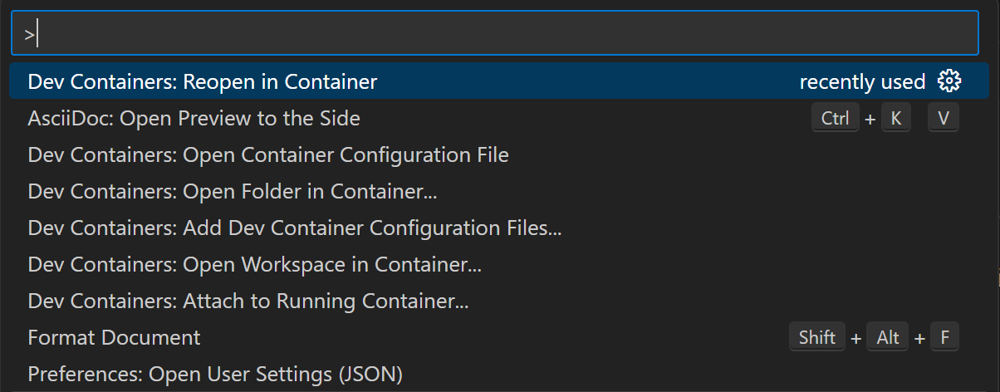
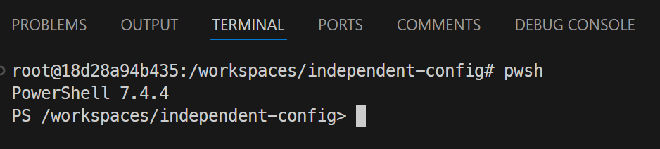

== Pre-Requisites

All of the examples in this document are designed to be run on a local workstation, it is a PoC after all. There are a few pre-reqs that are required:

* Docker Engine
** Docker Desktop
** Rancher Desktop
** Podman
* VS Code
** Devcontainer Extension

NOTE: When working within a Dev Container within VSCode is it necessary to use a different hostname when accessing the services that are running on the `localhost`. This host is `host.docker.internal`.

NOTE: This repo contains a configuration for using https://code.visualstudio.com/docs/devcontainers/create-dev-container[Dev Containers] within VSCode which enables to the use of the Ensono Independent Runner images. All examples shown below use this integration.

Start the DevContainer `Ctrl + Shift + p` and select `Dev Containers: Reopen in Container`.

.Reopening folder in Dev Container

Open a Terminal in the container, `Ctrl + Shift '` and then run `pwsh` in the terminal.

.Terminal running inside of Dev Container

